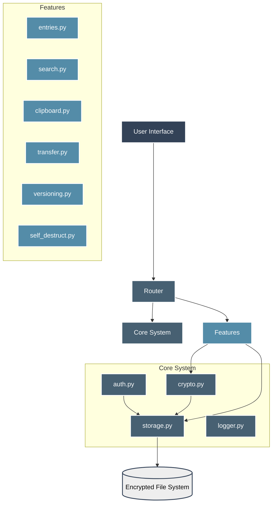
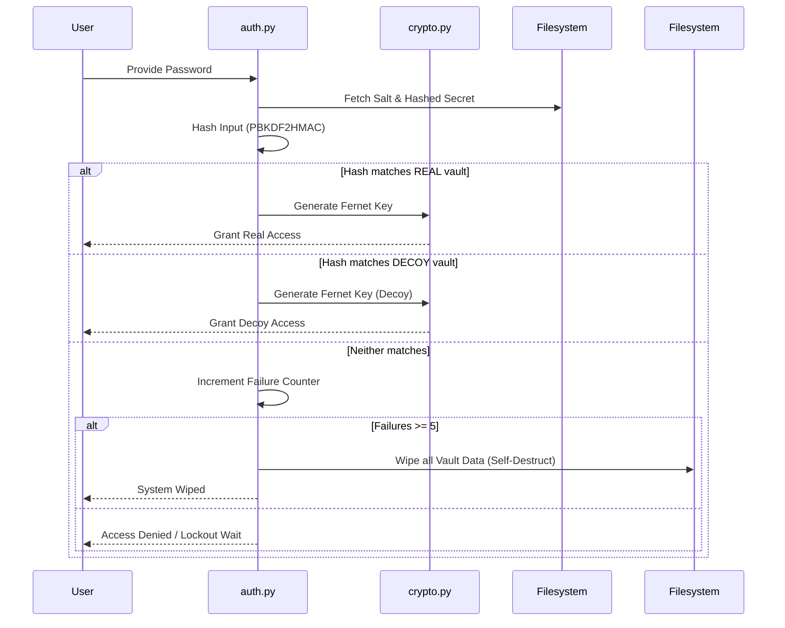
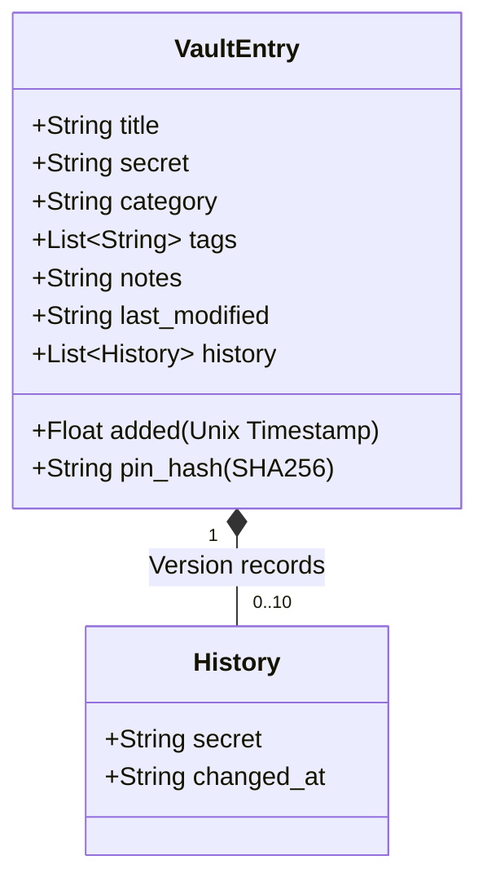

<div align="center">
  <h1>🛡️ Personal Secret Vault System (PESUTE)</h1>
  <p><b>Advanced Multi-User Cryptographic Vault with Decoy Capabilities & Auto-Destruct</b></p>
</div>

---

## 📌 Project Overview
The **Personal Secret Vault System (PESUTE)** is a high-security, command-line interface (CLI) application built in Python. Designed with a zero-trust architecture, it securely encrypts, manages, and stores user credentials, secrets, and private notes.

It features robust countermeasures against forced extraction, including **Decoy Vaults** (plausible deniability) and a **Self-Destruct** mechanism upon repeated unauthorized access attempts.

## ✨ Core Features & Visualizations
- 🔐 **Military-Grade Cryptography:** PBKDF2HMAC (SHA256, 100k iterations) for key derivation + Fernet (AES-128-CBC) for symmetric payload encryption.
- 👥 **Multi-User Architecture:** Independent cryptographic contexts per user.
- 🎭 **Plausible Deniability:** Native decoy vaults accessed via secondary passwords.
- 💣 **Anti-Bruteforce & Self-Destruct:** Progressive lockouts and complete data wiping upon excessive failed attempts.
- ⏱️ **Auto-Lock:** Inactivity timeouts seal the vault automatically.
- 📋 **Secure Clipboard:** Auto-clearing clipboard buffers (10-second decay).
- 🔄 **Versioning:** Tracks historical changes and prior secrets safely.
- 🔐 **Per-Entry PIN Protection:** Granular, hashed-PIN locks on individual high-security entries.

---

## 🏗️ System Architecture & Code Structure

The repository is modularly split into UI, Core (auth, crypto, storage), and Features. 

### Codebase Organization

``` text
PESUTE_Personal-Secret-Vault/
│
├── main.py                # Main execution, routing, & auth staging
├── config.py              # Secure timeouts, max attempts, and file paths
├── requirements.txt       # Dependencies (cryptography, rich)
│
├── core/                  # Core Systems
│   ├── auth.py            # Access control & hashing algorithms
│   ├── crypto.py          # Key derivation (PBKDF2HMAC) & AES wrapping
│   ├── storage.py         # File ingestion & encryption orchestration
│   └── logger.py          # Action/Audit logging mechanism
│
├── features/              # Modular Operations & Vault Actions
│   ├── entries.py         # Add, view, delete specific secrets & PIN protection
│   ├── search.py          # Title & tag based querying
│   ├── clipboard.py       # Asynchronous clipboard copying/flaring
│   ├── categories.py      # Folder/category views and sorting
│   ├── transfer.py        # Plaintext export & encrypted backups
│   ├── versioning.py      # Secret alteration logging & rollback history
│   ├── export_import.py   # Secure vault migration
│   ├── self_destruct.py   # Wipes local user files on excessive fails
│   └── password_generator.py # Random high-entropy generator
│
└── ui/                    # Presentation Layer
    ├── tui.py             # Rich layout wrappers & display grids 
    ├── prompts.py         # Standardized interactive inputs
    ├── display.py         # General formatting
    └── menus.py           # Option listing logic
```

### Dependency Architecture Chart



---

## 🔐 Authentication & Self-Destruct Flow

PESUTE intelligently routes users based on the physical password they provide, seamlessly transitioning them into either the genuine operational vault or a siloed fake vault. Repeated failures trigger self-destruction.



---

## 💾 State Encapsulation: The Entry Lifecycle

When a secret is added via `features/entries.py`, the vault constructs an intricate dictionary representing the secret's state. 

### Data Shape per Entry



### Adding an Entry Workflow
1. Custom input attributes are collected (`title`, plaintext `secret`, `tags`).
2. Optional `pin_hash` calculated via straight `hashlib.sha256(pin)` if double-lock chosen.
3. Timestamp appended for auditing.
4. Sent to `storage.save()`.
5. Every single JSON entry in the array is independently converted to string, then passed to `core.crypto.encrypt()` which wraps it in an AES layer, saving line-by-line cipher text.

---

## 📂 Detailed Module Operations & Line-by-Line Guide

### 1. `main.py` (Command Control)
The operational entry point of the entire architecture.
- **`vault_menu()`:** Acts as the interactive REPL loop. It establishes the `last_activity` timer and drops users into inactivity auto-locks (`AUTO_LOCK_SECONDS`). It acts as a switchboard routing choices ('1' to '15') directly into their dedicated `features/*` modules.
- **`landing_menu()`:** The pre-authorization staging area. Captures new registrations or triggers the `auth.verify()` pipeline. Multi-user dynamic path finding stems from here.

### 2. `core/auth.py` (The Gatekeeper)
The gateway module responsible for strict access checking.
- **`_generate_salt()` & `_hash()`:** Uses `os.urandom(16)` and `hashlib.pbkdf2_hmac` enforcing 100,000 iterations to completely neuter dictionary or rainbow-table runtime attacks.
- **`verify(username)`:** Iterates up to `MAX_ATTEMPTS`. Evaluates the given password against the primary hash OR the decoy hash. If failures mount over `SELF_DESTRUCT_ATTEMPTS` (5 by default), it dynamically imports and fires `features/self_destruct.wipe()`.

### 3. `core/crypto.py` (Cryptographic Engine)
Cryptographic engine managing the AES envelope.
- **`get_cipher()`:** Recreates the symmetric Fernet wrapper dynamically in RAM. Uses PBKDF2HMAC (SHA256) derived upon the user's plaintext password matched specifically to their persistent binary salt file (`_salt.bin`). 
- **`encrypt()` / `decrypt()`:** Abstraction wrapper using standard cryptography logic (`cipher.encrypt(string)`).

### 4. `core/storage.py` (Data Access Object)
- **`load()` / `save()`:** Orchestrates mapping objects from memory to physical disk. Prevents memory leaks and ensures that `decrypt()` is called strictly on line-by-line streams rather than giant singular payloads that might be sniffed in memory dumps.

### 5. `features/versioning.py` (Tamper Tracking)
Records modifications. When a user alters a secret, it migrates the *old* secret into the `history` sub-array of an entry, bounding it by `MAX_HISTORY` (default 10). Employs `features.entries.unlock_entry()` verifying entry-level PINs before edits occur.

### 6. `features/clipboard.py` (Data Scrambling)
Copies highly sensitive passwords to the host OS clipboard (`pyperclip` / OS native wrappers), but leverages Python `threading` or `asyncio` to initiate a decay timer. After `CLIPBOARD_CLEAR` (default 10s), it replaces clipboard contents with an empty string, effectively defending against clipboard-history monitors or accidental pastes.

### 7. `features/self_destruct.py` (Extremis Protocol)
A system-level fail-deadly apparatus. When initiated under brute-force duress, it navigates `config.DATA_DIR`, identifying the current user's profile, and forcefully removes (`os.remove()`) the hashed credentials, salt definitions, and the actual `.dat` payload blocks.

---

## 🛠️ Data Storage Topography
All records exist within the scoped `data/` directory using dynamic naming conventions to support concurrent multiple users on the same physical drive:

| File Name Convention                      | Purpose                                       | Encryption Layer |
|-------------------------------------------|-----------------------------------------------|------------------|
| `data/{username}_password.txt`            | Hashed representation of operational config.  | Output Hashed    |
| `data/{username}_salt.bin`                | High-entropy generation seed.                 | Raw Binary       |
| `data/{username}_decoy_password.txt`      | Hashed decoy trigger.                         | Output Hashed    |
| `data/{username}_vault.dat`               | Line-delimited AES production keys.           | Fernet (AES)     |
| `data/{username}_decoy_vault.dat`         | Line-delimited AES sterile mock environment.  | Fernet (AES)     |

## 🚀 Quick Setup & Installation

You can now easily install PESUTE as a global CLI tool using Python's package manager.

```bash
# 1. Clone the repository and CD into it
cd PESUTE_Personal-Secret-Vault

# 2. Install the package
pip install .

# 3. Boot the Vault System from anywhere!
pesute
```

> **[CAUTION] Data Sovereignty Warning:** Utilizing the self-destruct component wipes irreversible local keys instantly. Operate under zero-trust assumptions. Ensure you regularly employ `Transfer/Backup` to output encrypted, standalone vaults to an offline cold storage medium.
